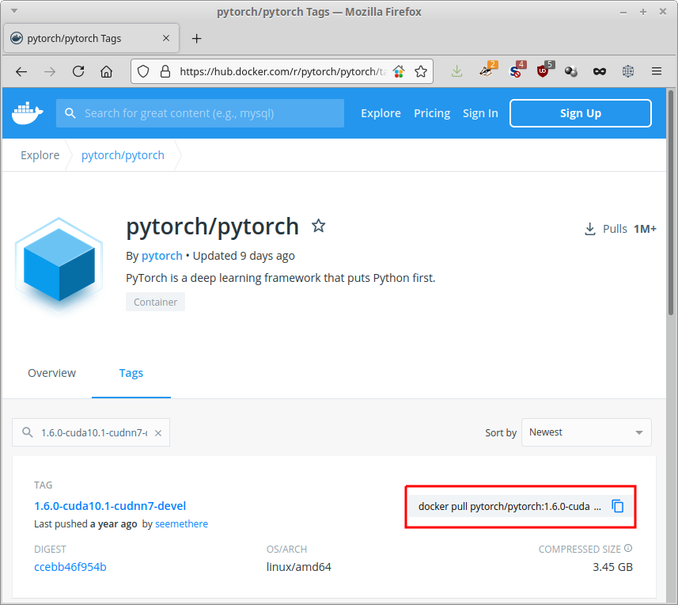

In this section we will touch on a very small subset of functionality provided by the `docker`
command-line tool. With this subset you will be able to use already existing images,
spinning up containers and being able to run code from the host machine within 
containers.

# Installation

If you do not have docker installed yet, then please do so. See the 
[official documentation](https://docs.docker.com/engine/install/) for your respective
operating system flavor.


# Pulling

Before you can use an image, you either need to build it locally or *pull* it from a 
registry. The latter is, obviously, done by the `pull` sub-command. The docker hub allows
you to quickly copy the pull command for a specific image (see highlighted area in
image below).



The URL that you can use with docker consists of these parts:
```
[registry-url/]namespace/image[:tag]
```

If the `registry-url` is omitted, it defaults to `docker.io/`. 
If `:tag` is omitted, it defaults to `:latest`.


The command copied from the above page looks like this:

```commandline
docker pull pytorch/pytorch:1.6.0-cuda10.1-cudnn7-devel
```

The namespace is `pytorch`, the image is `pytorch` and the tag is `1.6.0-cuda10.1-cudnn7-devel`.

When executing this command, all layers that have not been cached locally will be
downloaded. It will look similar to this screen, with each layer having its own
unique hash:

```commandline
metal:[101]~>docker pull pytorch/pytorch:1.6.0-cuda10.1-cudnn7-devel
1.6.0-cuda10.1-cudnn7-devel: Pulling from pytorch/pytorch
7ddbc47eeb70: Pull complete 
c1bbdc448b72: Pull complete 
8c3b70e39044: Pull complete 
45d437916d57: Pull complete 
d8f1569ddae6: Pull complete 
85386706b020: Pull complete 
ee9b457b77d0: Extracting [==================================================>]     184B/184B
be4f3343ecd3: Pulling fs layer 
30b4effda4fd: Waiting 
b398e882f414: Waiting 
4fe309685765: Waiting 
8b87a3cb3232: Waiting 
6cac8a6cf141: Waiting 
```

The output from the finished pull will look like this:

```commandline
metal:[103]~>docker pull pytorch/pytorch:1.6.0-cuda10.1-cudnn7-devel
1.6.0-cuda10.1-cudnn7-devel: Pulling from pytorch/pytorch
7ddbc47eeb70: Pull complete 
c1bbdc448b72: Pull complete 
8c3b70e39044: Pull complete 
45d437916d57: Pull complete 
d8f1569ddae6: Pull complete 
85386706b020: Pull complete 
ee9b457b77d0: Pull complete 
be4f3343ecd3: Pull complete 
30b4effda4fd: Pull complete 
b398e882f414: Pull complete 
4fe309685765: Pull complete 
8b87a3cb3232: Pull complete 
6cac8a6cf141: Pull complete 
Digest: sha256:ccebb46f954b1d32a4700aaeae0e24bd68653f92c6f276a608bf592b660b63d7
Status: Downloaded newer image for pytorch/pytorch:1.6.0-cuda10.1-cudnn7-devel
docker.io/pytorch/pytorch:1.6.0-cuda10.1-cudnn7-devel
```


# Running

Once an image has been downloaded, you can spin up a container. Think of a container
as a concrete instantiation of a blueprint (i.e., the image), which can receive
modifications that will stay until its removed. The sub-command for spinning up, 
is `run`.

When running an image (i.e., spinning up a container), this can be done either
in interactive mode or not. The former can be used at development time or for 
manually running experiments and the latter for a production setting, where you 
simply supply a command to executed within the container, like building model.

For interactive use, you will need the `-it` flags, which stand for `interactive`
and `tty` (**T**ele**TY**pewriter or console). For the time being, we will stick
with interactive mode. The non-interactive mode is explained briefly in
[Dockerfile/Running the image (non-interactive)](dockerfile.md#running-the-image-non-interactive)

Starting the just downloaded pytorch image in interactive mode is achieved with 
this command:

```commandline
docker run -it pytorch/pytorch:1.6.0-cuda10.1-cudnn7-devel
```

This will give you a prompt similar to this: 

```
root@1a3ae8deb7b3:/workspace#
```

Which you can exit like any other shell via `exit` or `CTRL+D`.

When starting up an image without specifying a name for the container (`--name`),
docker will give it an automatic generated name rather than just a hash, which 
can be quite humorous:

```
pedantic_herschel
```

If you want to list containers, you need to use the action `ls` of the `container` 
sub-command. If all containers, not just currently running ones, should be listed, 
then you need to add the `-a` option. So, for listing all containers on your system, 
run this:

```commandline
docker container ls -a
```

Other useful actions for the `container` sub-command are:

* `start` - start an existing container
* `stop` - stop a running container
* `rm` - remove a stopped container


# GPU support

The image that we downloaded comes with CUDA support, in order to make use of
an NVIDIA GPU that we have on our host system. But, the graphics card does not
automatically get made available to the containers, we need to explicitly state
that we want a container to have access to it.

For docker versions prior to 19.03 (e.g., still used by some NVIDIA IoT devices), 
you need to supply the following parameter:

```
--runtime=nvidia
```

Otherwise, use this:

```
--gpus=all
```

Or supply the specific ID of the GPU, if you are on a multi-GPU system 
([source](https://docs.nvidia.com/datacenter/cloud-native/container-toolkit/user-guide.html#gpu-enumeration)):

```
--gpus=1
```


# Volumes

By default, a docker container does not have access to any directories on the host
system and you will have to explicitly give access via *volumes*. Docker distinguishes
between *named* volumes (partitions created and managed by the docker daemon) and
simply mapped directories. Usually, it is sufficient to just map local directories
into your container. That way, you have full control over your data and models on 
the host system. 

The easist way to map a directory (or even a single file) is to use the 
`-v` or `--volume` option. The alternative is the `--mount` option, which gives 
you greater control (but seems like overkill most of the time for a data scientist). 
For more information, check out the docker documentation on 
[volumes](https://docs.docker.com/storage/volumes/).

One thing to be aware of is that you can hide directories within the container
by mapping an external directory onto an existing one, e.g., `/usr` or `/opt`.
This can have unexpected side effects, like missing libraries, executables, data, etc.
It is worthwhile to inspect the internals of a container first, before mapping
volumes willy-nilly.

The command below maps the `/some/where` directory of the host to the directory
`/opt/local` within the container:

```commandline
docker run \
    -v /some/where:/opt/local \ 
    -it pytorch/pytorch:1.6.0-cuda10.1-cudnn7-devel
```

Please note that directories need to be absolute paths. If you want to map the current 
directory into the container, then you can make use of the `pwd` command like this:

```commandline
docker run \
    -v `pwd`:/opt/local \ 
    -it pytorch/pytorch:1.6.0-cuda10.1-cudnn7-devel
```

Of course, the `-v` option can be supplied multiple times.


# Clean up

You will soon notice that you are accumulating a large number of containers
and images on your system, taking up significant space. Here are some commands
that you can use to clean up your system:

* stop all containers

    ```
    docker stop $(docker ps -a -q)
    ```
* remove all containers

    ```
    docker rm $(docker ps -a -q)
    ```

* purging all unused or dangling images, containers, volumes, and networks:

    ```
    docker system prune
    ```

* you can be even more aggressive when adding the `-a` flag:

    ```
    docker system prune -a
    ```


# Login & Credentials

When using non-public registries, you will most likely have to perform a login,
using the `login` sub-command (and `logout` for logging out). By default, docker
will store your password only base64 encoded and not encrypted. It is therefore
recommended using an external credentials store. For more information, see
the docker documentation on the [login command](https://docs.docker.com/engine/reference/commandline/login/).