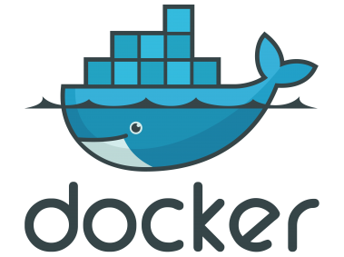

From one data scientist to another on how to utilize docker to make your life easier.

Any data scientist that ever had to set up an environment for a deep learning
framework, knows that getting the combination of CUDA, cuDNN, framework and other 
libraries right is a frustrating exercise. With docker you still have to go through 
the pain of figuring out the right combination, but... And it is a BIG but! Once you 
have this blueprint called *docker image*, you can use it on another machine; you 
will be up and running in seconds.

This is by no means supposed to be an exhaustive introduction to docker (docker 
can do a lot more!), but merely for getting you started on your journey.

To get started with docker, you should look at the following sections:

* [Basics](basics.md) - explains the most common operations that you will need to know 
* [Dockerfile](dockerfile.md) - explains the structure of the `Dockerfile` file which 
  is used to create docker images
* [Best practices](best_practices.md) - what to keep in mind when creating and using images
* [Repositories](repos.md) - where to find the base images that your own images will use

If you should encounter problems, then have a look here:

* [Troubleshooting](troubleshooting.md)

Just like with any programming language or complex framework, there are certain
things that can make your life easier. Therefore do not forget to have a look at:

* [Tips & Tricks](tips_and_tricks.md)

Once you got a handle on things, and you are getting tired on manually building images, 
you might want to look into automating your builds and maybe also run your own 
registry/proxy. In that case, have a look at the following sections:

* [Automation](automation.md)
* [Registry](registry.md)
